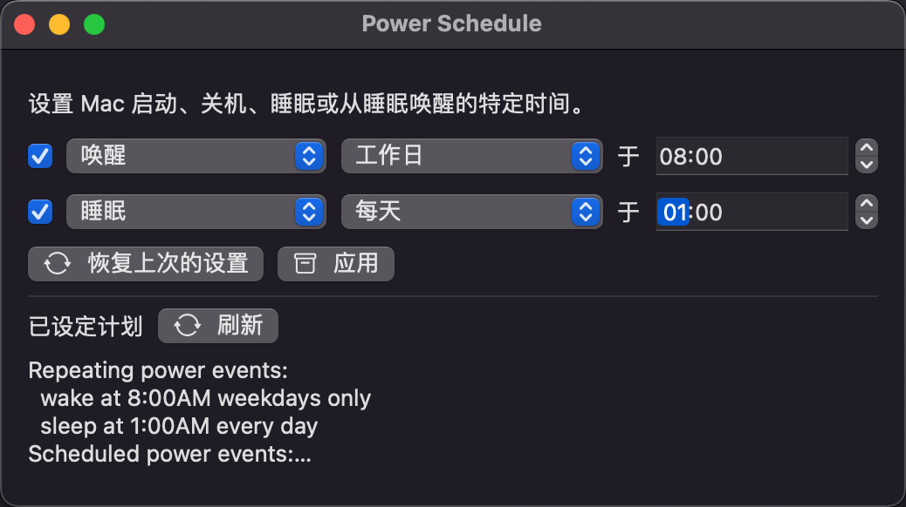

# PowerSchedule
macOS 上的电源计划管理软件(定时开关机设置)

macOS 13 之前有自带的系统设置界面, macOS 13 之后就去掉了, 所以写了这个软件, 方便设置定时开关机

### 软件截图

### 功能

基本保持跟 macOS 12 的系统电源定时界面功能一致, 后续会增加更多设置功能

目前支持按周期设置开关机时间，支持 `每天、工作日、周末、周几` 去设置 `启动或唤醒、启动、唤醒、睡眠、重新启动、关机` 的时间

### 下载安装

你可以自行下载源码编译. 

或者从 [releases](https://github.com/Hext123/PowerSchedule/releases) 页面下载最新包(`PowerSchedule.app.zip`), 下载后双击解压 `.zip` 包, 并使用右键打开 `.app` 包

### 接下来支持
- [ ] 支持按具体时间单次设置, 如 `2023-05-30 21:00:00 关机`
- [ ] 支持周期自定义搭配, 如 `每周一、周三 21:00 关机`

### 原理
- 通过 [pmset](x-man-page://pmset) 命令设置电源计划
    - `pmset -g sched`：查看当前定时。
    - `sudo pmset repeat wake M 8:00:00`：设置 Mac 定时在每周一上午 8 点唤醒。
- 通过 `/Library/Preferences/SystemConfiguration/com.apple.AutoWake.plist` 文件读取定时任务
